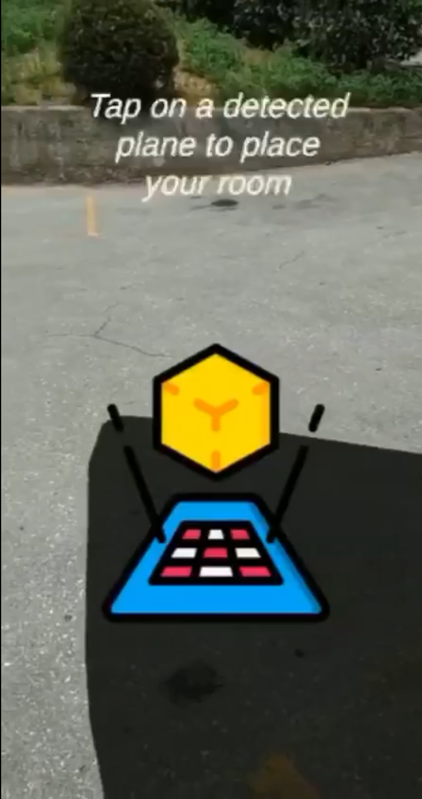

# AR-Portal

## Overview

Augmented Reality Monster Hunter Game! This project is the final project of Computer Graphics and Augmented Reality course, where I've created an interactive augmented reality (AR) gaming experience.

## Features

- **Three Exciting Levels**: Dive into the game's narrative across three distinct levels, each with its own challenges.

- **Plane Detection**: At the start of the game, we utilize ARCore plane detection technology to allow users to place the virtual room in the real world.

- **Immersive Gameplay**: Step into the AR environment and follow the guidance of a friendly butterfly character who provides instructions for your adventure.

- **Monster Invasion**: The game's storyline revolves around menacing monsters attempting to breach the room from the real world. Your mission is to fend off these creatures and protect your sanctuary.

- **Earn Rewards**: Defeating monsters grants you valuable coins that can be used to purchase furniture and decorate your room.

  

